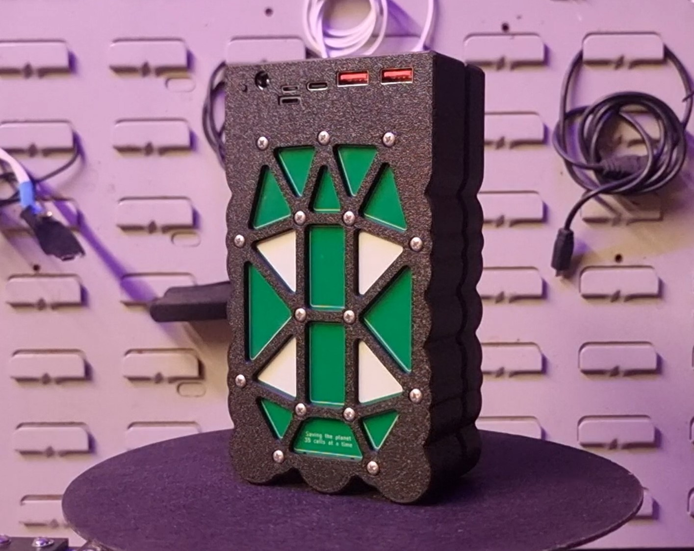

# Disposable Vape Powerbank Project

This repository contains everything you need to build a functional 100W power bank using lithium-ion cells salvaged from disposable vapes.



## 📺 Watch the Video

See the entire build process in action on my YouTube channel:

[Watch on YouTube](https://youtu.be/kMiJdfgIfqI)

---

This powerbank is an upgrade from my [initial design](https://www.youtube.com/watch?v=ehp23hrrEHY) and is now smaller, lighter, safer, and easier to assemble.
It’s a fantastic way to repurpose vape batteries and contribute to reducing e-waste while learning valuable electronics and 3D printing skills.

---

## ⚠️ Disclaimer

This project involves handling lithium-ion batteries, which can be dangerous if mishandled. By using these designs or instructions, you acknowledge and agree to the following:

- You assume all risks associated with the assembly and use of this project.
- This project is provided "as-is," with no guarantees of safety or performance.
- Always take appropriate safety precautions and seek professional guidance if unsure.

Please read the full [Disclaimer](DISCLAIMER.md) before proceeding.

---

## Affiliate Links & Sponsorship Disclosure

This repository contains affiliate links to suppliers and services. If you use these links to purchase parts (from Aliexpress) or sign up for services (such as JLCPCB), I may earn a small commission at no extra cost to you. These links help support the development of this project and my YouTube channel.

Thank you for supporting my work!

---

## 🚀 Project Overview

In this project, you will:
- Extract lithium-ion cells from disposable vapes.
- Test and prepare the cells for use.
- Assemble a 3D-printed cell holder and enclosure.
- Install custom PCBs to balance charge the cells and wire them up to form a 5S7P (5 cells in series, 7 cells in parallel) battery pack.
- Wire up a fast-charge USB powerbank board.

### Key Features:
- Doesn't require directly soldering the cells together.
- Multifunction PCBs (balance charging and power delivery) to reduce parts cost.
- Open-source PCBs & 3D prints for easy customization and collaboration.
- Supports 100W USB C PD charging.
---

## 📂 Repository Contents

This repository is organized as follows:
```
Disposable-Vape-Powerbank/
├── README.md           # Introduction and instructions
├── DISCLAIMER.md       # Full project disclaimer
├── LICENSE             # Project licensing details
├── PCB-Files/          # PCB related files
│   ├── Production-Files/   # PCB files for ordering
│   ├── Schematic.pdf       # PCB schematic
│   └── KiCad_Project/      # KiCAD project files
├── 3D-Models/          # Fusion360 files and links to printables
└── Images/             # Photos and renders of the project
```
## 🛠️ Quick Start Guide

Follow these steps to build your own disposable vape power bank:

1. *Download Files*
   - Click the green *Code* button and select *Download ZIP*. Then extract the repository files.
   - or clone the repository:
     git clone [https://github.com/username/Disposable-Vape-Powerbank.git](https://github.com/chrisdoelcreates/vape-power-bank)
     
2. *Order the PCBs*
    - Head over to [JLCPCB](https://jlcpcb.com/?from=cdd) (or any other PCB ordering site)
    - Sign up/Log in
    - Head to the order page
    - Upload the Gerber file from Disposable-Vape-Powerbank/PCB-Files/Production-Files/
    - Refer to 10:13 in the [project video](https://youtu.be/h3FRk3OD1Ug) for order settings
    - Ensure 'Assembly' is checked
    - Upload the CPL and BOM files
    - Rotate the connectors to match the orientation within the video
    - Place the order!
  *If you get an email asking if the polarities of the springs are correct - reply that they are*

3. *Order the USB board*
    - [USB board - Type 1 (Recommended - Used in the video)](https://s.click.aliexpress.com/e/_oBGOqhR)
       - *ENSURE THE 5S OPTION IS SELECTED*
    - [USB board - Type 2 (More USB C ports - requires different 3D prints to the video)](https://s.click.aliexpress.com/e/_oBXyxIH)
       - *ENSURE THE 5S OPTION IS SELECTED*

4. *Order the conductive tape*
    - [Conductive tape](https://s.click.aliexpress.com/e/_olaCL05)
       - *ENSURE the '10mm' & 'Conductive on both sides' options are selected*

5. *Order optional extras*
    - [Right angle JST connector](https://s.click.aliexpress.com/e/_oEeP6lf)
      - *ENSURE XH2.54MM, Length 10CM, 4P IS SELECTED*
      - Not essential but makes wiring the board slightly easier
    - [8 Channel Cell Tester](https://s.click.aliexpress.com/e/_oEuMn9T)
      - Also not essential
      - Allows you to match the battery capacities for each parallel row - improves powerbank battery life & lifespan
      - Good if you regularly do battery related projects

6. *Print the parts*
    - Download the cell holder
    - Download the enclosure
      - Select the enclosure depending on your board type
    - Print out the parts

7. *Build the Powerbank!*
     - Follow along with the Youtube video

---

## 🧾 Licensing

This project is licensed under the [MIT License](LICENSE). You are free to use, modify, and distribute the files, provided you include proper attribution and accept the project’s disclaimers.

---

## 🤝 Contributions

Contributions are welcome! If you have suggestions, improvements, or issues, feel free to:
- Open an issue in this repository.
- Submit a pull request with your changes.

---

## 🌟 Acknowledgments

A big thank you to:
- *JLCPCB* for sponsoring the youtube video/project.
- Everyone who has supported and engaged with my Youtube channel.

---

Enjoy building your power bank and contributing to e-waste reduction!
